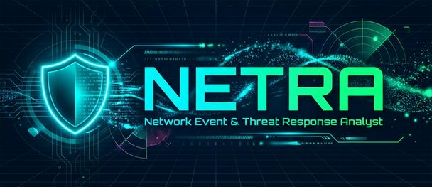
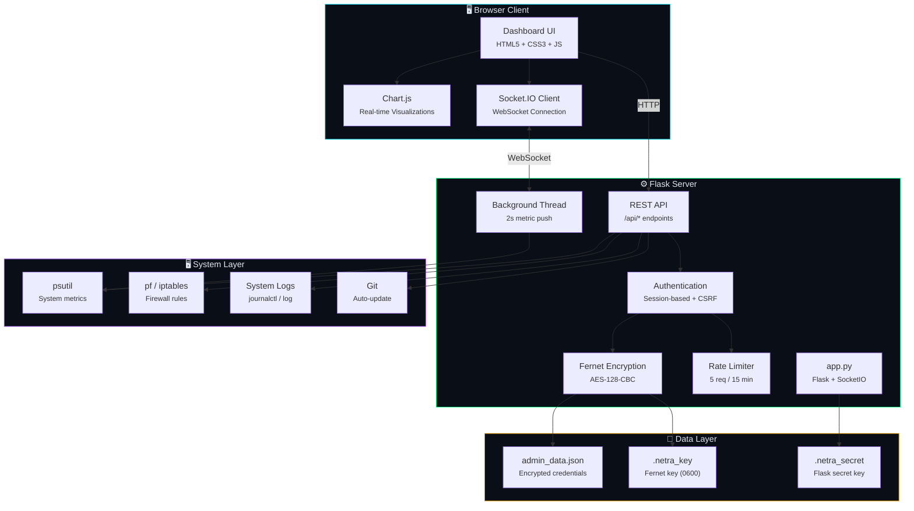
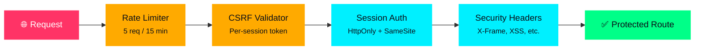

<div align="center">

<!-- Animated Banner -->


<br><br>

<!-- Animated Typing Header -->
<a href="https://github.com/avik-root/Netra">
  
</a>

<br>

<a href="https://github.com/avik-root/Netra">
  
</a>

<br><br>

<!-- Animated Badges -->


<br>


<br><br>

<!-- Animated Wave Divider -->


</div>

<br>

## 🔭 About

**NETRA** _(Network Event & Threat Response Analyst)_ is an industrial-grade, real-time cybersecurity monitoring tool built for system administrators and security professionals. It provides comprehensive visibility into system health, network activity, firewall rules, active connections, and security events — all through a stunning, futuristic web dashboard.

Built with **Flask**, **Socket.IO**, and **Chart.js**, NETRA delivers live metrics with sub-2-second refresh rates, encrypted credential storage, and enterprise-level security hardening out of the box.

<div align="center">

```
╔══════════════════════════════════════════════════════════════╗
║          NETRA – Network Event & Threat Response Analyst     ║
║          Version: 1.0.0                                      ║
║          Developed by: MintFire                              ║
║          Security: Rate Limiting | CSRF | Secure Headers     ║
╚══════════════════════════════════════════════════════════════╝
```

</div>

<br>

<div align="center">

</div>

<br>

## ⚡ Key Features

<table>
<tr>
<td width="50%">

### 🖥️ System Monitoring
- Real-time CPU, Memory, Disk & Swap tracking
- Per-core CPU usage visualization
- Disk partition analysis
- Battery status (laptops)
- System uptime & boot time

</td>
<td width="50%">

### 🌐 Network Intelligence
- Live bandwidth monitoring (upload/download)
- Interface discovery (WiFi, Ethernet, Bluetooth, VPN, Docker)
- Packet flow analysis per interface
- IPv4/IPv6/MAC address enumeration
- Real-time throughput charts

</td>
</tr>
<tr>
<td width="50%">

### 🛡️ Firewall & Security
- Firewall rule viewer (pf / iptables)
- Packet statistics (sent/received/errors/drops)
- Traffic distribution analysis
- Security event logging
- Real-time threat indicators

</td>
<td width="50%">

### 🔗 Connection Tracking
- Active TCP/UDP connection monitoring
- Process-to-connection mapping
- ESTABLISHED / LISTEN / TIME_WAIT tracking
- Local & remote address resolution
- Protocol distribution charts

</td>
</tr>
<tr>
<td width="50%">

### 📜 Log Analysis
- Real-time system log streaming
- Color-coded severity levels (info/warning/error)
- Full-text search & filtering
- Auto-scroll with manual override
- NETRA event integration

</td>
<td width="50%">

### 🔒 Enterprise Security
- **Fernet AES-128-CBC** encrypted credentials
- **CSRF protection** on all endpoints
- **Rate limiting** (5 attempts / 15 min)
- **Security headers** (X-Frame, XSS, etc.)
- **Strong password enforcement**

</td>
</tr>
</table>

<br>

<div align="center">

</div>

<br>

## 🏗️ Architecture



<br>

<div align="center">

</div>

<br>

## 📁 Project Structure

```
NETRA/
│
├── app.py                    # Flask server — routes, API, auth, security, WebSocket
├── requirements.txt          # Python dependencies
├── admin_data.json           # Encrypted admin credentials (auto-generated)
├── .netra_key                # Fernet encryption key (auto-generated, 0600)
├── .netra_secret             # Flask session secret key (auto-generated, 0600)
│
├── templates/
│   ├── dashboard.html        # Main dashboard — 8 monitoring panels
│   ├── login.html            # Authentication page with CSRF
│   └── setup.html            # First-time credential setup
│
└── static/
    ├── css/
    │   └── style.css         # Complete dark cyberpunk theme
    ├── js/
    │   └── main.js           # Chart.js, Socket.IO, CRUD logic
    └── img/
        ├── logo.png          # NETRA logo
        ├── favicon.png       # Browser tab icon
        └── banner.png        # README banner
```

<br>

<div align="center">

</div>

<br>

## 🚀 Quick Start

### Prerequisites

| Requirement | Version |
|:---|:---|
| **Python** | 3.9+ |
| **pip** | Latest |
| **Git** | Latest |
| **OS** | macOS / Linux |

### Installation

```bash
# 1. Clone the repository
git clone https://github.com/avik-root/Netra.git
cd Netra

# 2. Create virtual environment (recommended)
python3 -m venv venv
source venv/bin/activate

# 3. Install dependencies
pip install -r requirements.txt

# 4. Launch NETRA
python3 app.py
```

### 🌐 Access the Dashboard

```
http://localhost:5001
```

**Default Credentials** _(first launch only)_:
| Field | Value |
|:---|:---|
| Username | `netra` |
| Password | `pass0000` |

> ⚠️ **You will be prompted to set new credentials on first login.** The default password will no longer work after setup is complete.

<br>

<div align="center">

</div>

<br>

## 🔐 Security Architecture

NETRA implements **defense-in-depth** with multiple layers of security:



### Security Features

| Layer | Feature | Details |
|:---|:---|:---|
| **Encryption** | Fernet (AES-128-CBC) | Admin credentials encrypted at rest |
| **Key Storage** | File-based (0600) | `.netra_key` with restricted permissions |
| **Authentication** | Session-based | 8-hour persistent sessions |
| **CSRF** | Per-session tokens | Validated on all POST endpoints |
| **Rate Limiting** | IP-based | 5 login attempts per 15-minute window |
| **Session Cookies** | Secure flags | `HttpOnly`, `SameSite=Lax` |
| **Headers** | 5+ security headers | X-Frame-Options, X-Content-Type-Options, X-XSS-Protection, Referrer-Policy, Permissions-Policy |
| **Password Policy** | Strong enforcement | Min 8 chars, uppercase, lowercase, digit, special character |
| **API Security** | No-cache headers | `Cache-Control: no-store` on all API responses |
| **Logging** | Failed login tracking | IP address + remaining attempts logged |
| **Secret Key** | Persistent | Survives server restarts (`.netra_secret`) |

<br>

<div align="center">

</div>

<br>

## 📡 API Reference

All API endpoints require authentication. CSRF token must be included via `X-CSRF-Token` header for POST requests.

| Method | Endpoint | Description |
|:---:|:---|:---|
| `GET` | `/api/system` | CPU, memory, disk, swap, uptime, partitions |
| `GET` | `/api/network` | Interfaces, IO counters, active connections |
| `GET` | `/api/firewall` | Firewall status, rules, packet statistics |
| `GET` | `/api/services` | Running processes sorted by CPU usage |
| `GET` | `/api/connections` | TCP/UDP connections with process mapping |
| `GET` | `/api/logs` | System/security logs (last 5 minutes) |
| `GET` | `/api/info` | NETRA tool information |
| `POST` | `/api/change-password` | Change admin password (requires current) |
| `POST` | `/api/update` | Pull latest from Git repo |

### WebSocket Events

| Event | Direction | Payload |
|:---|:---:|:---|
| `system_metrics` | Server → Client | CPU, Memory, Disk, Network rates (every 2s) |
| `connect` | Client → Server | Connection established |
| `disconnect` | Client → Server | Connection terminated |

<br>

<div align="center">

</div>

<br>

## 🔄 Auto-Update

NETRA supports automatic updates from the Git repository while preserving your admin credentials:

```bash
# Via dashboard: Settings → Check & Update
# Or via API:
curl -X POST http://localhost:5001/api/update \
  -H "X-CSRF-Token: <your-token>" \
  -b "session=<your-session>"
```

**What's preserved during updates:**
- ✅ `admin_data.json` — Encrypted credentials
- ✅ `.netra_key` — Encryption key
- ✅ `.netra_secret` — Flask session key

<br>

<div align="center">

</div>

<br>

## 🧩 Tech Stack

<div align="center">

| Category | Technology | Purpose |
|:---|:---|:---|
| **Backend** |  | Web framework & routing |
| **Real-time** |  | WebSocket live data push |
| **System** |  | Cross-platform system metrics |
| **Encryption** |  | Fernet AES-128-CBC |
| **WSGI** |  | Async WebSocket support |
| **Charts** |  | Real-time data visualization |
| **Icons** |  | Professional iconography |

</div>

<br>

<div align="center">

</div>

<br>

## 🎨 Dashboard Panels

<div align="center">

| Panel | Icon | Description |
|:---|:---:|:---|
| **Overview** | 📊 | System health at a glance — CPU, RAM, Disk, Network charts |
| **Network Monitor** | 🌐 | Interface details, bandwidth, packet analysis |
| **Firewall & Packets** | 🛡️ | Firewall rules, traffic distribution, error tracking |
| **Services** | ⚙️ | Process list with CPU/Memory, top consumers |
| **System Resources** | 🖥️ | Per-core CPU, memory breakdown, swap, partitions |
| **Connections** | 🔗 | Active TCP/UDP connections, process mapping |
| **Logs** | 📜 | Live log stream with color-coded severity |
| **Settings** | ⚡ | Admin password change, auto-update, security info |

</div>

<br>

<div align="center">

</div>

<br>

## 🤝 Contributing

Contributions are welcome! To contribute:

1. **Fork** the repository
2. **Create** your feature branch (`git checkout -b feature/amazing-feature`)
3. **Commit** your changes (`git commit -m 'Add amazing feature'`)
4. **Push** to the branch (`git push origin feature/amazing-feature`)
5. **Open** a Pull Request

Please ensure your code follows the existing style and includes appropriate security measures.

<br>

<div align="center">

</div>

<br>

## 📄 License

This project is licensed under the **MIT License** — see the [LICENSE](LICENSE) file for details.

<br>

<div align="center">

</div>

<br>

<div align="center">

### Developed with 🔥 by **MintFire**

<br>

<a href="https://github.com/avik-root/Netra">
  
</a>

<br><br>


<br><br>

⭐ **Star this repo if you find NETRA useful!** ⭐

</div>
